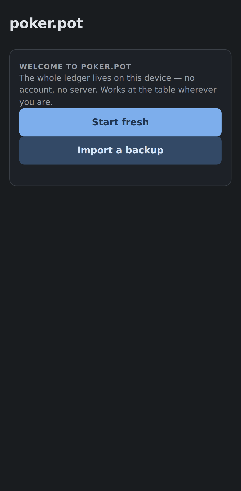
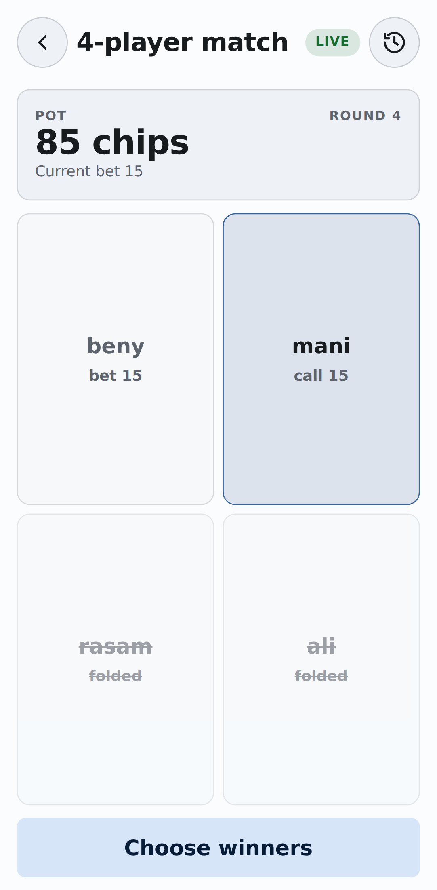
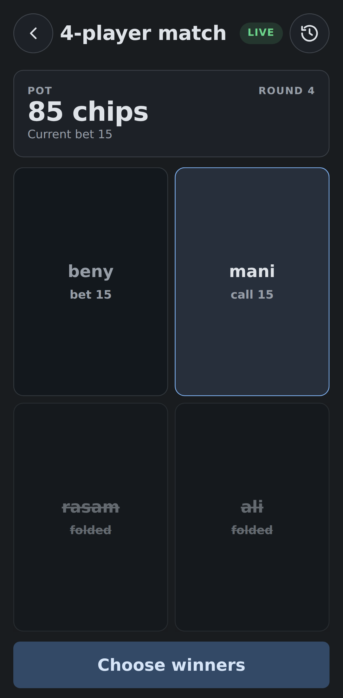
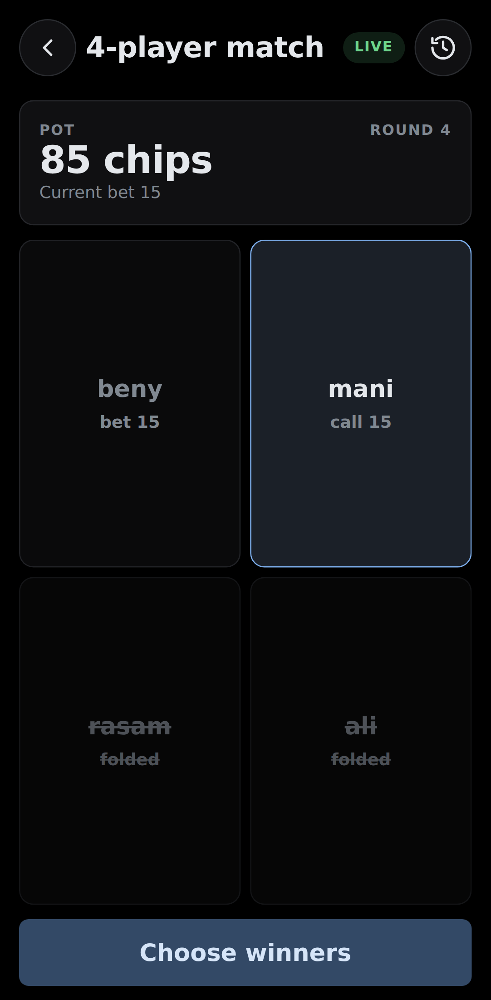

# poker.pot

A phone-viewport pot manager for poker games with friends. It keeps a betting
ledger; it does not deal cards or rank hands, and the group picks the winners.

One phone is passed around the table. Each player taps their own name and records
fold / check / call / raise. Every action is written to on-device storage as it
happens, so a sudden exit or shutdown does not lose the current round. History is
visible and editable, and standings recompute from it.

> **Not standard poker.** poker.pot runs a custom house ruleset with no blinds,
> no fixed turn order, and no hand ranking. The full ruleset is in
> [rules.md](rules.md). The [LICENSE](LICENSE) is "do whatever you want".

## Screenshots

| Sessions | Live match | Ledger |
| --- | --- | --- |
|  |  |  |

| Session overview | Settings | First-run setup |
| --- | --- | --- |
|  |  |  |

| Light | Dark | OLED |
| --- | --- | --- |
|  |  |  |

The base screenshots are captured in Dark; the theme strip shows the same live
match in Light / Dark / OLED.

Regenerate them with `bun run screenshots`. The script builds the app, starts a
throwaway server on `127.0.0.1:7407` (it does not touch any real data), seeds a
demo session into the browser's on-device storage, and captures the screens with
Playwright. Install the browser once with `bunx playwright install chromium`. If
the Playwright CDN is blocked, prefix the install with
`PLAYWRIGHT_DOWNLOAD_HOST=https://cdn.npmmirror.com/binaries/playwright`.

The app icons come from `public/poker-chip-logo.svg`, converted with
`bun run icons`.

## Install

All data lives on the device; there is no account and no server to configure.

- **Android:** grab the APK from the latest
  [release](https://github.com/benyamin-git/poker.pot/releases) and install it.
  Every release tag triggers a build signed with the project keystore.
- **iPhone / iPad:** open `https://benyamin-git.github.io/poker.pot/` in Safari,
  tap Share, then **Add to Home Screen**. The app installs as a home-screen app
  with its own icon and works offline.

## Quick start

Requires [Bun](https://bun.sh).

```bash
bun install
bun run dev
```

`bun run dev` starts the Vite dev server on `0.0.0.0:7404`. Open
`http://<computer-ip>:7404` on the phone.

To serve the built app over the LAN from one process:

```bash
bun run build
bun start
# or, for a detached background server:
./scripts/live.sh
```

`bun start` serves `dist/` on `0.0.0.0:7403`. Open
`http://<computer-ip>:7403` on the phone. The port comes from `PORT` (default
`7403`).

`scripts/live.sh` starts the same server detached (`nohup`), building `dist/`
first if needed. It logs to `/tmp/poker.pot-liveserver.log`, writes a pid to
`/tmp/poker.pot-liveserver.pid`, and prints the stop command. Override the port
with `LIVE_SERVER_PORT`.

The app ships Light, Dark, and OLED themes with six accent colors (blue by
default), switched in Settings → Appearance. The first run follows the system
`prefers-color-scheme`, OLED is opt-in, and the choice is stored per device.

Other scripts: `bun run test`, `bun run test:watch`, `bun run typecheck`,
`bun run lint`, `bun run format`, `bun run theme`, `bun run screenshots`,
`bun run icons`, `bun run version:set`.

`bun run theme` regenerates `src/client/styles/tokens.css` from the palette in
the design reference; the file is committed and never hand-edited.

`bun run version:set <x.y.z>` rewrites the version in `package.json` and
`src-tauri/Cargo.toml` (plus the lockfile) before tagging a release.

`bin/dev`, `bin/build` and `bin/run` are wrappers around the matching `bun`
commands for shell aliasing.

## Data and backups

Everything lives in the browser's IndexedDB on the installing device: players,
limits, sessions, and history. There is no server-side store.

Backups are a single YAML file. Export it from Settings → Data, then import it on
another device:

- **Replace** wipes local data and loads the backup.
- **Merge** applies the backup into local data; conflicts are shown one at a
  time and each is resolved per item.

Export a backup before switching phones or clearing browser data. Browser
storage can be evicted under disk pressure; the exported file is the durable
copy. Keep it somewhere safe — importing the same file twice replaces or merges
by your choice, it never duplicates.

## Release and versioning

Every push to `main` runs the test suite (`ci.yml`) and deploys the PWA
(`pages.yml`) to `https://benyamin-git.github.io/poker.pot/`.

To ship a version:

```bash
bun run version:set 0.2.0   # bump package.json, Cargo.toml, Cargo.lock
git add . git commit -m "release: 0.2.0"
git tag v0.2.0
git push origin main --tags
```

The tag push builds a signed Android APK with the release keystore (secrets:
`ANDROID_KEY_BASE64`, `ANDROID_KEY_ALIAS`, `ANDROID_KEY_PASSWORD`) and opens a
draft release with the APK attached. Publish the draft when you have verified it
on a device. `CHANGELOG.md` keeps a log of what changed per version.

## Betting rules

The full ruleset is in [rules.md](rules.md). In short:

- Every session starts at zero. Balances can go negative; it is a ledger, not a
  stack of physical chips.
- Preflop, you can fold or raise but not check, so the first player must open
  with at least `minRaise`. Calls are allowed once there is a bet.
- Later rounds, check when there is no bet; otherwise fold, call (match the
  round's highest bet), or raise (beat it by at least `minRaise`).
- A raise reopens the action for anyone who already acted and is now behind.
- `maxBet` is cumulative across the whole match. Hitting it is all-in; that
  player sits out further rounds but can still win.
- Folding is final, and folding as the last active player is blocked. If
  everyone else folds, the last player wins automatically.
- Winners are chosen manually from the players who have not folded. The pot is
  split equally; leftover chips go to random winners, and the assignment is
  stored so history never changes.

Chip counts are integers.

## Tests

`bun run test` runs the Vitest suite (Node environment, no browser):

- `domain` — replay, raises/calls/folds, all-in and winner payouts.
- `domain-commands` — history edits, session lifecycle and error codes.
- `domain-invariants` — seeded random valid play asserting the ledger stays
  zero-sum.
- `config` — `validateConfig` and `resolvePlayers`.
- `server-static` — static serving, index fallback and path traversal defense.
- `storage` — Dexie store, meta and revision handling (fake-indexeddb).
- `backup` and `backup-flow` — YAML bundle round-trips, replace/merge and
  conflict resolution.
- `onboarding`, `client-format` and `ui` — the first-run gate, client helpers
  and smoke renders.
- `icons` — generated icon set invariants.
- `theme` and `theme-runtime` — token generator invariants (documented
  primaries, every accent × theme role set, contrast, committed CSS) and
  appearance persistence.
- `match-turn` — the live match's next-player selection.

## Project layout

```
src/domain/    pure ledger engine (sessions, matches, rounds, winners)
src/server/    static file server for the built client
src/client/    React + Vite app (on-device storage, backup, themes)
src-tauri/     Tauri Android shell (signed APK builds)
public/icons/  generated app icons
tests/         Vitest suites
scripts/       theme, icons and screenshot generators, version bump,
               artifact collection
dist/          build output, generated by bun run build
```