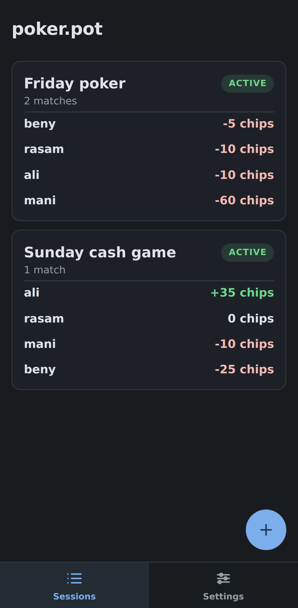
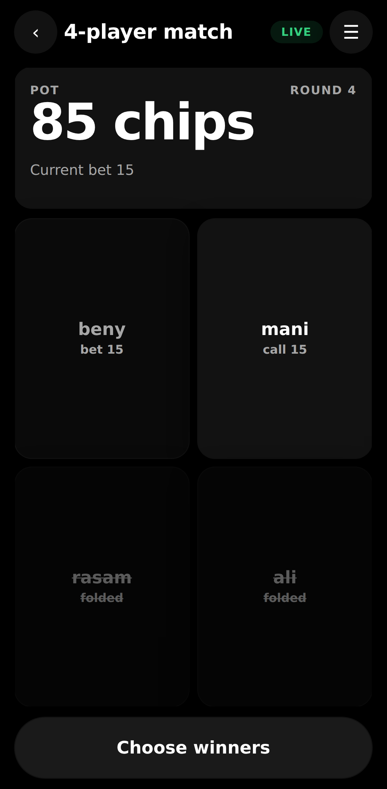
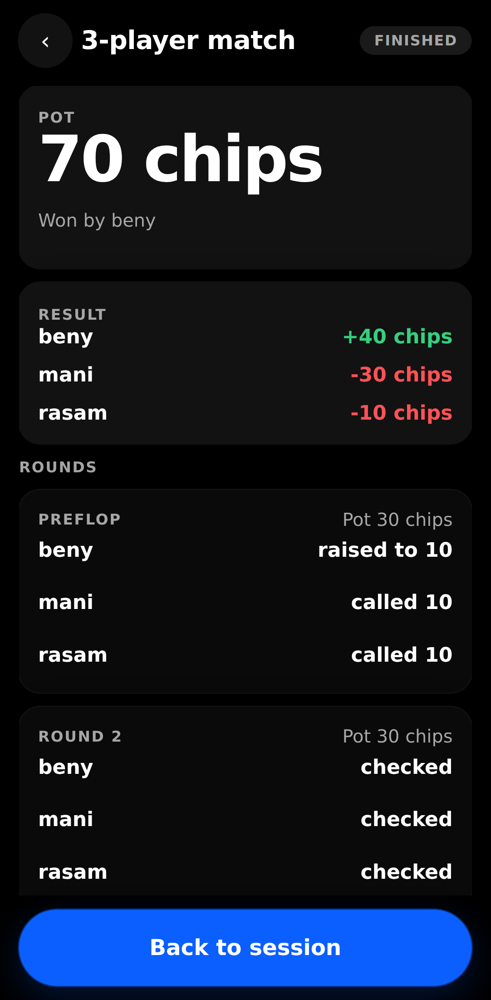
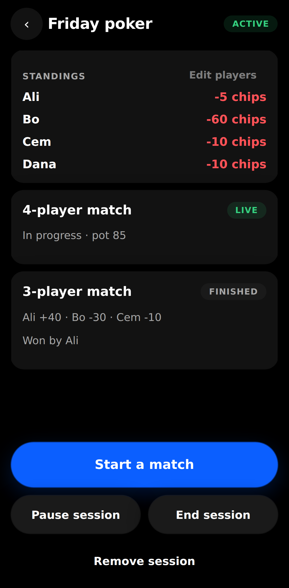
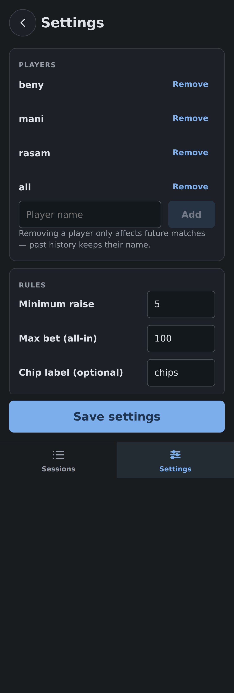
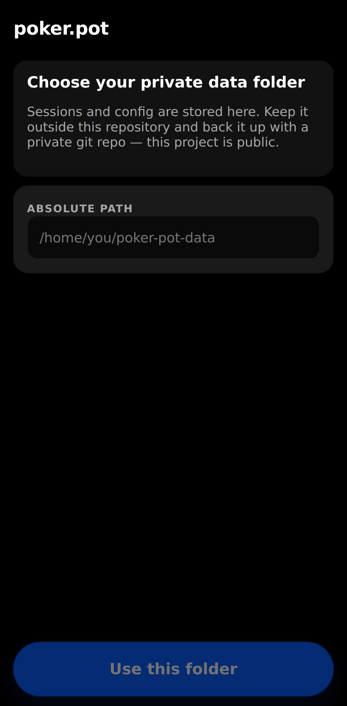

# poker.pot

A phone-viewport pot manager for poker games with friends. No cards, no hand
ranking — the app keeps a clean betting ledger and the group picks the winners.

- Pass one phone around: each player taps their name and records fold / check /
  call / raise.
- Every match and every betting round is written to disk instantly, so a sudden
  exit or shutdown never loses data.
- History is fully visible and editable (with confirmations) and recomputes
  standings automatically.

## Screenshots

| Sessions | Live match | Ledger |
| --- | --- | --- |
|  |  |  |

| Session overview | Settings | First-run setup |
| --- | --- | --- |
|  |  |  |

Regenerate them with `bun run screenshots`. It builds the app, boots a throwaway
server (never touching your real `location.yaml`), seeds a demo session and
captures the screens with Playwright. Install the browser once with
`bunx playwright install chromium` (if the Playwright CDN is blocked, prefix it
with `PLAYWRIGHT_DOWNLOAD_HOST=https://cdn.npmmirror.com/binaries/playwright`).

## Quick start

```bash
bun install
bun run dev          # Vite dev server (http://localhost:5173) + API on :3001
```

For a phone on the same network:

```bash
bun run build
bun start            # serves the built app and API on 0.0.0.0:3001
```

Then open `http://<your-computer-ip>:3001` on the phone.

Other scripts: `bun run test`, `bun run typecheck`, `bun run lint`,
`bun run format`, `bun run screenshots`.

`bin/dev`, `bin/build` and `bin/run` are thin wrappers around the matching
`bun` commands for convenient shell aliasing.

## Tests

`bun run test` runs the Vitest suite (Node environment, no browser needed):

- `domain` — replay, raises/calls/folds, all-in and winner payouts.
- `domain-commands` — history edits, session lifecycle and error codes.
- `domain-invariants` — seeded random valid play asserting the ledger stays
  zero-sum.
- `config` — `validateConfig` / `resolvePlayers`.
- `server` — setup, config and session REST routes over a temp data dir.
- `client-format` and `ui` — client helpers plus SSR smoke renders.

## Private data, public repo

This repository is public. **Session data and config live outside it**, in a
private folder you choose:

```
<dataDir>/
  config.yaml          # players, minRaise, maxBet, optional currencyLabel
  sessions/<id>.yaml   # one file per session, full history
```

The pointer to that folder is `location.yaml` in this repo, which is
**gitignored** (a template ships as `location.example.yaml`). You can also set
it through the first-run setup screen.

Keep `<dataDir>` as its own **private** git repository to back it up. The files
are human-readable YAML so diffs are meaningful. Never commit the data folder
into this public repo.

## Config

`config.yaml`:

```yaml
players:
  - id: 3f0c...        # stable id; history references this, never the name
    name: Ali
minRaise: 5            # a raise must beat the round's current bet by this much
maxBet: 100            # cumulative per match; reaching it is all-in
currencyLabel: chips   # optional
```

Removing a player from the config only affects future match pickers — past
matches keep their own participant snapshot.

## Betting rules

> **Warning:** this app is **not** built for any standard poker betting rules.
> It implements a custom house ruleset used by me and my friends — no blinds,
> no fixed turn order, no hand ranking, and winners are picked by hand. If you
> want a more standard version, you are encouraged to fork and build one; the
> [LICENSE](LICENSE) is "do whatever you want".

The full ruleset lives in [rules.md](rules.md). In short:

- Every session starts at zero. Balances can go negative; it is a ledger, not a
  stack of physical chips.
- Preflop: fold or raise; you cannot check, so the first player must open with
  at least the minimum raise. Calls are allowed once there is a bet.
- Later rounds: check when there is no bet, otherwise fold, call (match the
  round's highest bet) or raise (beat it by at least the minimum raise).
- A round closes when every player still in has matched the round's highest bet
  (or everyone has checked when there is no bet). A raise reopens the action
  for anyone who already acted and is now behind.
- `maxBet` is cumulative across the whole match. Hitting it is all-in; that
  player sits out further rounds but can still win.
- Folding is final for the match. Folding when you are the last player in is
  blocked. If everyone else folds, the last player wins automatically.
- Winners are chosen manually from the players who have not folded. The pot is
  split equally; leftover chips that do not divide evenly are assigned to
  random winners and the assignment is stored so history never changes.

Chip counts are integers. (The original sketch asked for floats; the integer
remainder rule was chosen instead.)

## Session lifecycle

- **Start / create**: pick a subset of the config players.
- **Pause / resume**: temporary stop.
- **End**: locks the session permanently (history stays readable).
- **Remove**: permanent delete, guarded by a GitHub-style typed confirmation.

A session roster can be changed between matches only. Each match snapshots its
own roster, so players can join some matches and skip others without corrupting
history. Once a match records its first action, its roster is locked.

## Project layout

```
src/domain/    pure ledger engine (sessions, matches, rounds, winners)
src/server/    Bun HTTP API, atomic YAML storage, setup/config
src/client/    React + Vite app (MD3-inspired AMOLED theme)
src/shared/    API types shared by client and server
tests/         Vitest: domain, commands, invariants, server, client, UI
```

Every mutation is validated, applied in memory, then written with a
temp-file + rename under a per-session lock. Unreadable session files are moved
to `sessions/.quarantine/` instead of breaking the app.
